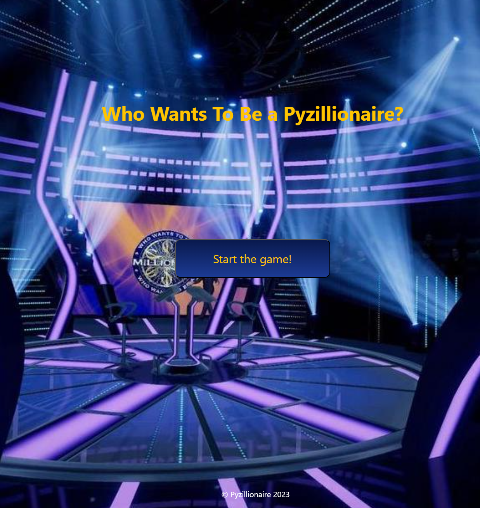

# Welcome to "Pyzillionaire"
###  Overview
This project is a Quiz Game that leverages the Trivia API to fetch and present a variety of questions to users. Players 
can test their knowledge across different categories, difficulty levels, and question types. The game keeps track of scores and provides feedback on correct or incorrect answers.



### Features

- Categories: The game contains questions from variable categories.
-  Difficulty Levels: Contains all the difficulty levels that suit your expertise.
- Interactive Gameplay: Engaging quiz format with immediate feedback.
- Score Tracking: Keep track of your score as you progress through the game.
- Random Questions: Enjoy a diverse set of questions for an enhanced gaming experience.

## Technology

### Framework

The current version of the template is based on:

- Python 3.11.*
- Django 4.6.*

### Database: PostgreSQL 4.16

- Currently, there are applied settings for Postgres server which is defined `settings.py`.
  The developer is free to configure the settings for any database technology that business needs require.


## Installation (MacOS / Linux / Windows)
#### All the following commands and installations are strongly advised to be done in the virtual environment.
Installation:

1. Create and activate a virtual environment. The current template's Python version is `3.11`.

       python3.11 ```-m venv venv```
       source ```venv/bin/activate```

2. Install requirements:\
```pip install -r requirements.txt```

3. Migrate migrations:\
 ```python manage.py migrate```

4. Create a superuser for the Django admin panel:\
```python manage.py createsuperuser```


5. Run Django server:\
 ```python manage.py runserver```

6. Verify the deployment by navigating to your server address in your preferred browser:
127.0.0.1:8000


# Credits

#### Team 2 SDA PythonRemoteEE18  2023
#### Trauma dream

